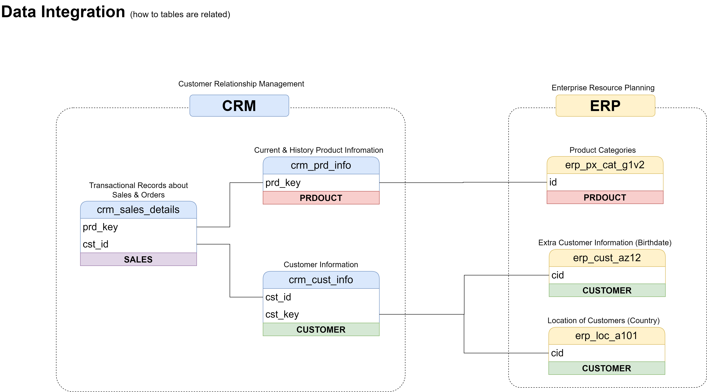
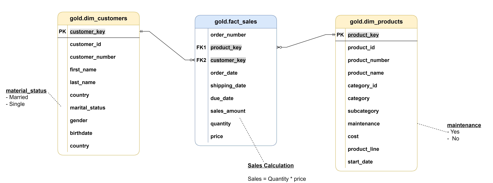

# Data Warehouse & Analytics Project: ERP & CRM Integration

## Project Overview
This project focuses on building an end-to-end Data Warehouse solution using **PostgreSQL**. The goal is to consolidate fragmented data from two primary source systems—**ERP** and **CRM**—into a unified, analytics-ready environment. 

I implemented a **Medallion Architecture** (Bronze, Silver, Gold) to ensure data quality and traceability, transforming raw CSV extracts into a structured **Star Schema** for business intelligence.

---

## 1. Requirements & Scope
The main objective was to create a robust pipeline for the sales department to enable data-driven decision-making.

*   **Data Sources:** CSV files from CRM and ERP systems.
*   **Key Requirements:**
    *   Resolve data quality issues (duplicates, nulls, inconsistent formats).
    *   Integrate disparate sources into a single data model.
    *   Provide documentation for both technical and business stakeholders.
*   **Scope:** Focus on the latest snapshot (Full Load strategy); historization (SCD) was not required for this phase.

---

## 2. Data Architecture
I chose the **Medallion Architecture** to manage the data lifecycle:

1.  **Bronze (Raw):** Direct ingestion of source data.
2.  **Silver (Cleaned):** Data validation, casting, and standardization.
3.  **Gold (Analytics):** Business-level aggregates and Star Schema modeling.

> [!TIP]
> **Architecture Design**
> )
> *High-level overview of the data flow from source to reporting.*

---

## 3. Project Standards & Initialization
To maintain a professional and scalable codebase, I followed these naming conventions:
*   **Naming:** `snake_case` for all objects (tables, columns, procedures).
*   **Language:** English for all metadata and documentation.
*   **SQL Best Practices:** Avoided reserved words and focused on modular SQL scripts.

---

## 4. Bronze Layer (Ingestion)
The Bronze layer acts as the landing zone. I developed a specialized SQL script (`load_scripts.sql`) and a stored procedure to automate the daily ingestion of CSV files.

**Key Features of the Bronze Load Procedure:**
*   **Truncate & Load:** Ensures a fresh start for each load to prevent duplication in this layer.
*   **Performance Monitoring:** I implemented `batch_start_time` and `batch_end_time` logic to track the duration of the ETL process. This helps identify bottlenecks early.
*   **Logging:** The procedure uses `RAISE NOTICE` to provide real-time feedback (e.g., "Loading CRM Tables...", "Loaded X rows...").
*   **Error Handling:** Utilizes `EXCEPTION` blocks to log `SQLERRM` and `SQLSTATE` for easier debugging if a file load fails.

> [!NOTE]
> Storing frequently used code in **Stored Procedures** significantly reduced manual errors and improved execution speed.

---

## 5. Silver Layer (Transformation & Data Quality)
This layer is where the raw data is refined into a high-quality, consistent format. Before writing any transformation code, I performed a deep-dive analysis of the Bronze data to identify hidden issues.

**The Transformation Workflow (Applied to all 6 tables):**
For each of the six source tables (`crm_cust_info`, `erp_loc_a101`, etc.), I followed a rigorous 4-step process:

1.  **Data Quality Audit:** I carefully checked the Bronze layer for each table to identify inconsistencies, such as spaces, invalid characters, or incorrect data types.
2.  **Column-Level Transformation:** Instead of bulk loading, I applied specific transformation rules to **every single column**. This included:
    *   Standardizing text (e.g., trimming spaces, handling case sensitivity).
    *   Casting data types (e.g., converting strings to dates or integers).
    *   Handling null values and business logic corrections.
3.  **Clean Loading (Truncate & Load):** To ensure data integrity and prevent duplication, I implemented a "Truncate" step. Each Silver table is completely emptied before inserting the newly transformed data.
4.  **Post-Load Verification:** After each transformation, I ran validation queries on the Silver tables to verify that the data correctly reflects the source while meeting our quality standards.

> [!TIP]
> **Data Integration Map**
> I created a comprehensive mapping to visualize how these tables connect after the transformation process.
> 

**Automation:**
Once I perfected the transformation logic for all tables, I consolidated the entire workflow into a single **Stored Procedure**. This ensures the Silver layer can be refreshed with one command while maintaining all the quality checks mentioned above.

---

## 6. Gold Layer (Presentation)
For the final layer, I implemented a **Star Schema** to optimize query performance for BI tools.

**The Workflow:**
1.  **Business Object Analysis:** Identified core entities (Customers, Products, Sales).
2.  **Dimension vs Fact:** Categorized data into descriptive dimensions and measurable facts.
3.  **Renaming:** Changed technical source names into "user-friendly" business names (e.g., `erp_px_cat_g1v2` becomes `dim_products`).

**Data Model Structure:**
*   **Fact Table:** Central sales data.
*   **Dimension Tables:** `dim_customers`, `dim_products`.

> [!IMPORTANT]
> **Relationship Logic (1:N):** In this model, dimensions have a **1-to-Many** relationship with the fact table. A customer exists once in the `dim_customers` table but can appear multiple times in the `fact_sales` table through various orders.

---

## 7. Data Modeling & Catalog
The final structure is visualized below:

To ensure the warehouse remains maintainable, I created a **Data Catalog**. It serves as the "Source of Truth" for column definitions and data types.
*   [View Data Catalog](docs/data_catalog.md)

---

## 8. Final Data Flow
The project concludes with a fully automated pipeline that moves data from raw CSVs to a clean, modeled Gold layer, providing a reliable foundation for any BI or reporting tool.

---

### How to Run
1.  Clone the repository.
2.  Run the DDL scripts in `scripts/` to create schemas.
3.  Execute the Bronze stored procedure to load raw data.
4.  Execute the Silver and Gold procedures to transform and model the data.

---
